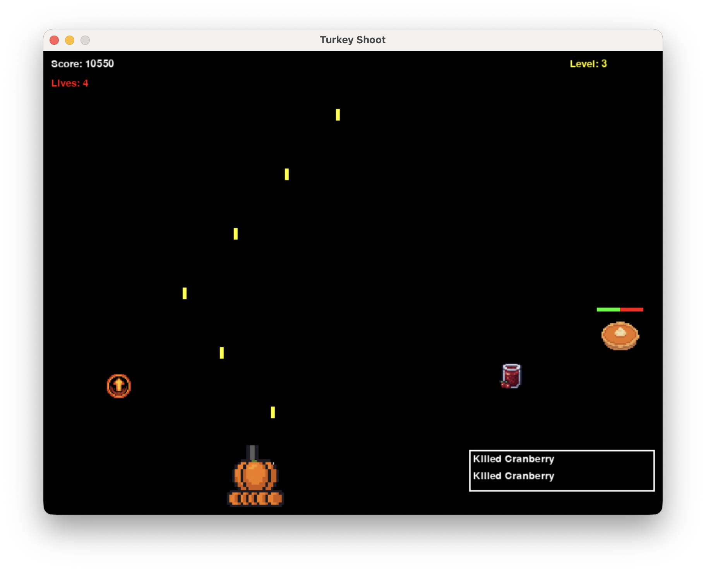

# Turkey Shoot

A quirky 2D Thanksgiving-themed shooting game built with Python and Pygame.



## Features

- **Three Difficulty Levels**: Easy, Medium, and Hard
- **Multiple Enemy Types**: Turkey, Pumpkin Pie, Cranberry Sauce, Stuffing, Mashed Potatoes, and Gravy Boat boss
- **Progressive Difficulty**: Levels get harder with more enemies and faster speeds
- **Boss Battles**: Face off against the Gravy Boat every 5 levels
- **High Score System**: Top 10 scores saved for each difficulty level
- **Unique Enemy Behaviors**: Straight drops, zigzag patterns, and sine wave movements

## Installation

1. Make sure you have Python 3.7+ installed
2. Create and activate a virtual environment (recommended):
   ```bash
   python3 -m venv .venv
   source .venv/bin/activate  # On Windows: .venv\Scripts\activate
   ```
3. Install dependencies:
   ```bash
   pip install -r requirements.txt
   ```

## How to Play

Run the game:
```bash
python main.py
```

### Controls
- **Arrow Keys** or **A/D**: Move left/right
- **SPACE**: Shoot
- **ESC**: Return to main menu (during gameplay)

### Gameplay
- Shoot down waves of Thanksgiving-themed enemies
- Each enemy type has different point values and behaviors
- Don't let enemies reach the bottom or collide with you
- Survive as long as possible and rack up high scores

### Difficulty Levels
- **Easy**: 5 lives, slower enemies, longer spawn intervals
- **Medium**: 3 lives, normal speed, balanced gameplay
- **Hard**: 2 lives, fast enemies, quick spawns

### Enemy Types
- **Turkey** (100 pts): Standard enemy, straight movement
- **Cranberry Sauce** (50 pts): Fast but predictable
- **Stuffing** (75 pts): Moderate speed, appears in groups
- **Pumpkin Pie** (150 pts): Zigzag movement pattern
- **Mashed Potato** (200 pts): Tanky, requires 2 hits
- **Gravy Boat** (500 pts): Boss enemy, sine wave movement, 5 hits

## Level Progression
- Each level spawns 20% more enemies than the previous
- Speed increases by 10% every 3 levels
- New enemy types unlock at levels 2, 4, and 6
- Boss levels occur every 5 levels

## High Scores
High scores are automatically saved to `data/highscores.json` and persist between game sessions. Each difficulty level maintains its own leaderboard of the top 10 scores.

## Project Structure
```
turkey_shoot/
├── main.py              # Game entry point
├── game.py              # Main game loop and state management
├── player.py            # Player class
├── enemies.py           # Enemy classes and behaviors
├── projectiles.py       # Bullet system
├── collision.py         # Collision detection
├── scoring.py           # Score management
├── levels.py            # Level progression
├── ui.py                # UI and menus
├── constants.py         # Game configuration
├── data/
│   └── highscores.json  # Persistent high scores
└── assets/              # Future: sprites and sounds
```

## Development
This game uses simple geometric shapes for graphics. Future enhancements could include:
- Custom sprites for enemies and player
- Sound effects and background music
- Power-ups (rapid fire, multi-shot, shields)
- More enemy types and patterns
- Particle effects

## License
Created for educational and entertainment purposes.

Enjoy shooting those Thanksgiving treats!
